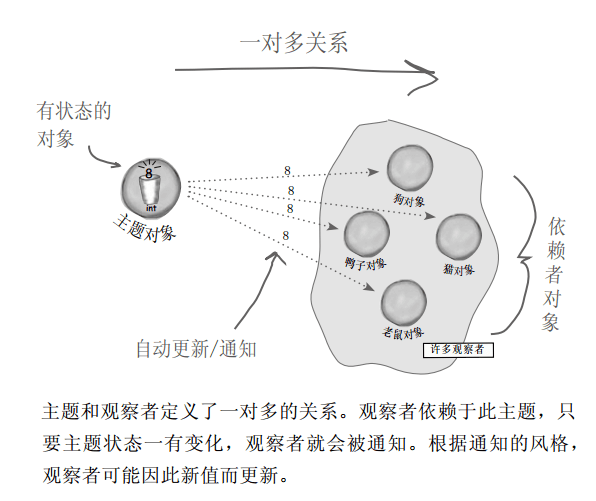
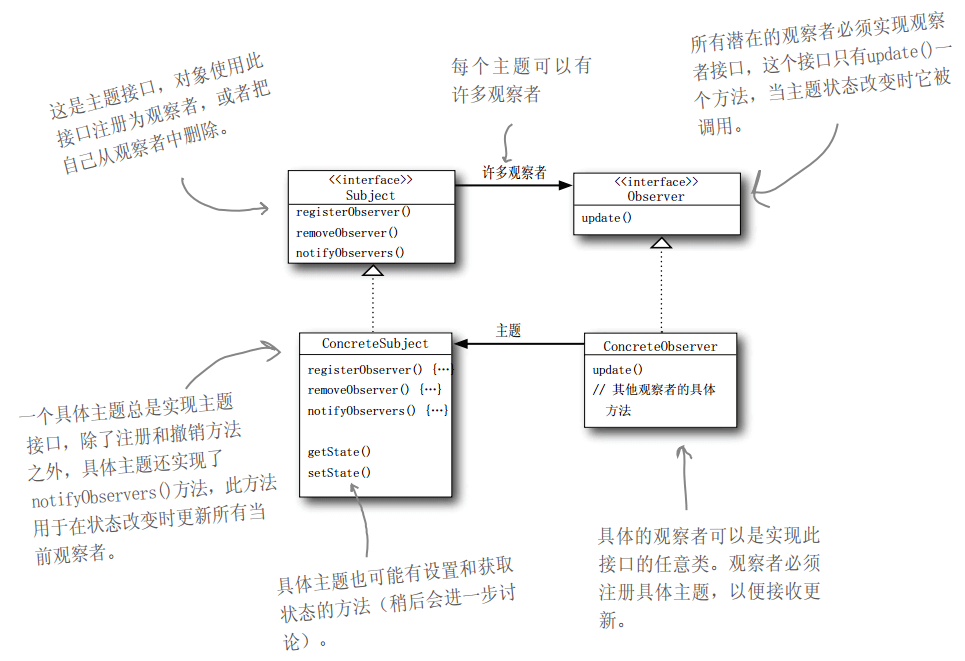

# Java设计模式---观察者模式

Tags： 设计模式

---

更多文章请转至我的博客:[DevWiki的博客](http://blog.csdn.net/devwiki)

##故事概要

###概要

故事要从一个业务需求开始:
> 天气监测站目前可以监测到气温,气压,湿度三种指标,有一个WeatherData类,当前面的三个数据发生变化时,就会调用WeatherData类的setWeatherData()方法,改变天气数据.

现在要求:需要有两个显示装置显示现在的状态和平均状态.当监测的数据有变化时,就更新显示.而且需要提供给第三方的人员可调用这些数据以设置想要的显示装置.如下图:


下面是给出的WeatherData类:
```java
public class WeatherData {

    private float temp;
    private float humidity;
    private float pressure;
    
    public WeatherData(){}
    
    public void setWeatherData(float temp, float humidity, float pressure){
        this.temp = temp;
        this.humidity = humidity;
        this.pressure = pressure;
        dataChanged();
    }
    
    public void dataChanged(){
        //数据发生变化则调用此方法,可在此处填写你的代码
    }
    
    public float getTemp() {
        return temp;
    }
    
    public float getHumidity() {
        return humidity;
    }
    
    public float getPressure() {
        return pressure;
    }
}
```
###提取已知条件

目前已知的条件:
1. WeatherData具有三个getter方法,可获取到温度,气压和湿度三个数值.
2. 当监测到新的数据时就会调用dataChanged()方法.
3. 需要实现两个显示器,一个显示当前状况(CurrentConditionsDisplay),一个显示平均状态(AvgStateDisplay).
4. 系统要能扩展,第三方可以组合实现显示器.

###简单实现
根据以上前提,可以用以下方法实现:
```java
public void dataChanged(){
    //数据发生变化则调用此方法,可在此处填写你的代码
    currentConditionsDisplay.update(temp, humidity, pressure);
    avgStateDisplay.update(temp, humidity, pressure);
}
```
其中,CurrentConditionsDisplay和AvgStateDisplay如下:
```java
//显示当前状态
public class CurrentConditionsDisplay{

    private float temp;
    private float humidity;
    private float pressure;
    
    public void update(float temp, float humidity, float pressure) {
        this.temp = temp;
        this.humidity = humidity;
        this.pressure = pressure;
        display();
    }
    
    public void display(){
        //显示当前状态
        String displayData = "CurrentConditions[temp=" + temp + ", humidity=" + humidity + 
            ", pressure="+ pressure + "]";
        System.out.println(displayData);
    }
}


//显示平均状态
public class AvgStateDisplay {

    public void display() {
        System.out.println(getShowInfo());
    }
    
    private String getShowInfo(){
        StringBuilder displayData = new StringBuilder();
        if (tempList.size() == 0) {
            displayData.append("暂时没有数据...");
            return displayData.toString();
        }
        
        float tempAve = calculatorAve(tempList);
        displayData.append("平均气温:" + tempAve);
        
        float humidityAve = calculatorAve(humidityList);
        displayData.append(",平均湿度:" + humidityAve);
        
        float pressureAve = calculatorAve(pressureList);
        displayData.append(",平均压强:" + pressureAve);
        
        return displayData.toString();
    }
    
    private float calculatorAve(List<Float> dataList){
        float sum = 0F;
        for (Float float1 : dataList) {
            sum = sum + float1;
        }
        float ave = sum/dataList.size();
        return ave;
    }
    
    private List<Float> tempList;
    private float temp;
    private List<Float> humidityList;
    private float humidity;
    private List<Float> pressureList;
    private float pressure;
    
    public void update(float temp, float humidity, float pressure) {
        this.temp = temp;
        this.humidity = humidity;
        this.pressure = pressure;
        if (tempList == null) {
            tempList = new ArrayList<Float>();
        }
        tempList.add(temp);
        
        if (humidityList == null) {
            humidityList = new ArrayList<Float>();
        }
        humidityList.add(humidity);
        
        if (pressureList == null) {
            pressureList = new ArrayList<Float>();
        }
        pressureList.add(pressure);
        display();
    }
}
```
这不就实现了刚才的功能:
1. 能显示当前状态
2. 能显示平均状态
3. 第三方可以通过WeatherData的dataChanged()方法获取数据,自己任意显示.

##有没有问题?

上一篇文章学习了Java设计的原则:

> 封装变化和面向接口编程

上述的实现中:
```java
public void dataChanged(){
    //数据发生变化则调用此方法,可在此处填写你的代码
    currentConditionsDisplay.update(temp, humidity, pressure);
    avgStateDisplay.update(temp, humidity, pressure);
}
```
这个里面的3,4两句是变化的,这部分没有封装.而且应该面向接口编程而不是面向具体的类编程,如果增加第三方的显示器,只能修改此处添加代码

##认识观察者模式

###从订阅报纸开始
报纸的订阅过程一般如下:

- 报社的业务就是出版报纸。
- 向某家报社订阅报纸，只要他们有新报纸出版，就会给你送来。只要你是他们的订户，你就会一直收到新报纸。
- 当你不想再看报纸的时候，取消订阅，他们就不会再送新报纸来。
- 只要报社还在运营，就会一直有人（或单位）向他们订阅报纸或取消订阅报纸。

观察者模式就和上面的订报纸差不多:

> 出版者改称为“主题”（Subject），订阅者改称为“观察者”（Observer）


###定义观察者模式

> 定义了对象之间的一对多依赖，这样一来，当一个对象改变状态时，它的所有依赖者都会收到通知并自动更新。



###观察者模式的类图



从以上类图可以看出,观察者模式的是遵守针对接口编程原则的.

##手动实现气象站的观察者模式

###1.观察者接口
观察者是一个接口:Observer
```java
public interface Observer {
    //用于更新的方法
    void update(float temp, float humidity, float pressure);
}
```

###2.观察对象接口
贯彻对象接口有三个作用:
1. 观察者注册为观察者
2. 观察者解除注册
3. 数据更新时通知观察者

```java
public interface Subject {

    //注册为观察者
    void registerObserver(Observer observer);
    
    //解除注册
    void unregisterObserver(Observer observer);
    
    //通知观察者
    void notifyObserver();
    
}
```

###3.新的WeatherData类

其中的setter是给气象站设置数据使用.getter是给第三方获取数据使用

```java
public class WeatherData implements Subject{

    private float temp;
    private float humidity;
    private float pressure;
    private List<Observer> observerList;
    
    public WeatherData(){
        observerList = new ArrayList<Observer>();
    }
    
    public void setWeatherData(float temp, float humidity, float pressure){
        this.temp = temp;
        this.humidity = humidity;
        this.pressure = pressure;
        dataChanged();
    }
    
    public void dataChanged(){
        notifyObserver();
    }
    
    public void registerObserver(Observer observer) {
        observerList.add(observer);
    }

    public void unregisterObserver(Observer observer) {
        int index = observerList.indexOf(observer);
        if (index >= 0) {
            observerList.remove(observer);
        }
    }

    public void notifyObserver() {
        for (Observer observer : observerList) {
            observer.update(temp, humidity, pressure);
        }
    }
    
    public float getTemp() {
        return temp;
    }
    
    public void setTemp(float temp) {
        this.temp = temp;
    }
    
    public float getHumidity() {
        return humidity;
    }
    
    public void setHumidity(float humidity) {
        this.humidity = humidity;
    }
    
    public float getPressure() {
        return pressure;
    }
    
    public void setPressure(float pressure) {
        this.pressure = pressure;
    }
}
```

###4.显示器接口
显示器接口是用来实现各种显示器的
```java
public interface DisplayElement {
    
    void display();
}
```

###5.显示器的实现类:CurrentConditionsDisplay和AvgStateDisplay类

CurrentConditionsDisplay:当前状态显示器
AvgStateDisplay:平均状态显示器

```java
public class CurrentConditionsDisplay implements Observer, DisplayElement {

    private WeatherData weatherData;
    
    public CurrentConditionsDisplay(WeatherData weatherData){
        this.weatherData = weatherData;
        weatherData.registerObserver(this);
    }
    
    public void unregister(){
        weatherData.unregisterObserver(this);
    }
    
    public void display() {
        String displayData = "CurrentConditions[temp=" + temp + ", humidity=" + humidity + ", pressure="
                + pressure + "]";
        System.out.println(displayData);
    }

    private float temp;
    private float humidity;
    private float pressure;
    public void update(float temp, float humidity, float pressure) {
        this.temp = temp;
        this.humidity = humidity;
        this.pressure = pressure;
        display();
    }
}

//---------------------------------------------------------------//

public class AvgStateDisplay implements Observer, DisplayElement{
    
    private WeatherData weatherData;
    public AvgStateDisplay(WeatherData weatherData){
        this.weatherData = weatherData;
        weatherData.registerObserver(this);
    }
    
    public void unregister(){
        weatherData.unregisterObserver(this);
    }

    public void display() {
        System.out.println(getShowInfo());
    }
    
    private String getShowInfo(){
        StringBuilder displayData = new StringBuilder();
        if (tempList.size() == 0) {
            displayData.append("暂时没有数据...");
            return displayData.toString();
        }
        
        float tempAve = calculatorAve(tempList);
        displayData.append("平均气温:" + tempAve);
        
        float humidityAve = calculatorAve(humidityList);
        displayData.append(",平均湿度:" + humidityAve);
        
        float pressureAve = calculatorAve(pressureList);
        displayData.append(",平均压强:" + pressureAve);
        
        return displayData.toString();
    }
    
    private float calculatorAve(List<Float> dataList){
        float sum = 0F;
        for (Float float1 : dataList) {
            sum = sum + float1;
        }
        float ave = sum/dataList.size();
        return ave;
    }
    
    private List<Float> tempList;
    private float temp;
    private List<Float> humidityList;
    private float humidity;
    private List<Float> pressureList;
    private float pressure;
    public void update(float temp, float humidity, float pressure) {
        this.temp = temp;
        this.humidity = humidity;
        this.pressure = pressure;
        if (tempList == null) {
            tempList = new ArrayList<Float>();
        }
        tempList.add(temp);
        
        if (humidityList == null) {
            humidityList = new ArrayList<Float>();
        }
        humidityList.add(humidity);
        
        if (pressureList == null) {
            pressureList = new ArrayList<Float>();
        }
        pressureList.add(pressure);
        display();
    }
}
```

###6.测试
测试气象站数据变化时能否通知当前状态显示器和平均状态显示器更新数据
```java
public class WeatherStation {
    
    public static void main(String[] args) {
        WeatherData weatherData = new WeatherData();
        
        CurrentConditionsDisplay currentDisplay = new CurrentConditionsDisplay(weatherData);
        AvgStateDisplay stateDisplay = new AvgStateDisplay(weatherData);
        
        weatherData.setWeatherData(25.0F, 80F, 1.01F);
        try {
            Thread.sleep(3000);
        } catch (InterruptedException e) {
            e.printStackTrace();
        }
        weatherData.setWeatherData(26.2F, 76F, 1.02F);
        try {
            Thread.sleep(3000);
        } catch (InterruptedException e) {
            e.printStackTrace();
        }
        weatherData.setWeatherData(27.8F, 70F, 1.01F);
    }
}
```
输出结果为:
```java
CurrentConditions[temp=25.0, humidity=80.0, pressure=1.01]
平均气温:25.0,平均湿度:80.0,平均压强:1.01
CurrentConditions[temp=26.2, humidity=76.0, pressure=1.02]
平均气温:25.6,平均湿度:78.0,平均压强:1.015
CurrentConditions[temp=27.8, humidity=70.0, pressure=1.01]
平均气温:26.333334,平均湿度:75.333336,平均压强:1.0133333
```

###7.增加酷热指数的显示器:HeatIndexDisplay
```java
public class HeatIndexDisplay implements Observer, DisplayElement{

    private WeatherData weatherData;
    public HeatIndexDisplay(WeatherData weatherData){
        this.weatherData = weatherData;
        weatherData.registerObserver(this);
    }
    
    public void unregister(){
        weatherData.unregisterObserver(this);
    }
    
    @Override
    public void display() {
        System.out.println("当前酷热指数:" + getHeatIndex());
    }
    
    private float getHeatIndex(){
        float heatIndex = 0F;
        //此处酷热指数计算公式不正确,是随意写的
        heatIndex = (float) (temp*Math.PI + humidity*Math.E + pressure*1.01315)/5;
        return heatIndex;
    }

    private float temp;
    private float humidity;
    private float pressure;
    @Override
    public void update(float temp, float humidity, float pressure) {
        this.temp = temp;
        this.humidity = humidity;
        this.pressure = pressure;
        display();
    }
}
```
###8.测试第三方的显示器
```java
public class WeatherStation {
    
    public static void main(String[] args) {
        WeatherData weatherData = new WeatherData();
        
        CurrentConditionsDisplay currentDisplay = new CurrentConditionsDisplay(weatherData);
        AvgStateDisplay stateDisplay = new AvgStateDisplay(weatherData);
        HeatIndexDisplay heatIndexDisplay = new HeatIndexDisplay(weatherData);
        
        weatherData.setWeatherData(25.0F, 80F, 1.01F);
        try {
            Thread.sleep(3000);
        } catch (InterruptedException e) {
            e.printStackTrace();
        }
        weatherData.setWeatherData(26.2F, 76F, 1.02F);
        try {
            Thread.sleep(3000);
        } catch (InterruptedException e) {
            e.printStackTrace();
        }
        weatherData.setWeatherData(27.8F, 70F, 1.01F);
    }
}
```
测试结果如下:
```java
CurrentConditions[temp=25.0, humidity=80.0, pressure=1.01]
平均气温:25.0,平均湿度:80.0,平均压强:1.01
当前酷热指数:59.40513
CurrentConditions[temp=26.2, humidity=76.0, pressure=1.02]
平均气温:25.6,平均湿度:78.0,平均压强:1.015
当前酷热指数:57.98651
CurrentConditions[temp=27.8, humidity=70.0, pressure=1.01]
平均气温:26.333334,平均湿度:75.333336,平均压强:1.0133333
当前酷热指数:55.727856
```

###小结
经过以上测试,我们使用了观察者模式实现了:
1. 气象站测试到数据-->发布数据变更--->更新各个不同类型的显示器.
2. 实现了当前状况的显示和平均状态的显示
3. 开发者可是自行实现多种形式的显示器

##Java内置的观察者模式

###Java内置的主题
Java内部的主题存在java.util包下,其源码如下:
```java
public class Observable {
    private boolean changed = false;
    private Vector<Observer> obs;

    public Observable() {
        obs = new Vector<>();
    }

    public synchronized void addObserver(Observer o) {
        if (o == null)
            throw new NullPointerException();
        if (!obs.contains(o)) {
            obs.addElement(o);
        }
    }

    public synchronized void deleteObserver(Observer o) {
        obs.removeElement(o);
    }

    public void notifyObservers() {
        notifyObservers(null);
    }

    public void notifyObservers(Object arg) {
    
        Object[] arrLocal;

        synchronized (this) {
            if (!changed)
                return;
            arrLocal = obs.toArray();
            clearChanged();
        }

        for (int i = arrLocal.length-1; i>=0; i--)
            ((Observer)arrLocal[i]).update(this, arg);
    }
    
    public synchronized void deleteObservers() {
        obs.removeAllElements();
    }

    protected synchronized void setChanged() {
        changed = true;
    }

    protected synchronized void clearChanged() {
        changed = false;
    }

    public synchronized boolean hasChanged() {
        return changed;
    }

    public synchronized int countObservers() {
        return obs.size();
    }
}
```
内置的主题类提供:增加观察者,删除观察者,删除所有观察者,提醒某个观察者,提醒所有观察者,获取观察者的数量,设置数据变化等方法.

与自定义的主题不同的是:

1. java内置的主题是一个类不是一个接口.
2. java内置的主题必须手动设置数据变化,即setChanged().否则主题不会通知观察者.

###Java内置的观察者
java内置的主题在java.util包下,其源码如下:
```java
public interface Observer {
    void update(Observable o, Object arg);
}
```
与自定义的观察者一致.

##使用Java内置的观察者模式实现气象站

###WeatherData类
```java
public class WeatherData extends Observable{

    private float temp;
    private float humidity;
    private float pressure;
    
    public WeatherData(){}
    
    public void setWeatherData(float temp, float humidity, float pressure){
        this.temp = temp;
        this.humidity = humidity;
        this.pressure = pressure;
        dataChanged();
    }
    
    public void dataChanged(){
        setChanged();
        notifyObservers();
    }
    
    public float getTemp() {
        return temp;
    }
    
    public float getHumidity() {
        return humidity;
    }
    
    public float getPressure() {
        return pressure;
    }
}
```

###CurrentConditionsDisplay
```java
public class CurrentConditionsDisplay implements Observer, DisplayElement {

    private Observable observable;
    public CurrentConditionsDisplay(Observable observable){
        this.observable = observable;
        observable.addObserver(this);
    }
    
    public void unregister(){
        observable.deleteObserver(this);
    }
    
    public void display() {
        String displayData = "CurrentConditions[temp=" + temp + ", humidity=" + humidity + ", pressure="
                + pressure + "]";
        System.out.println(displayData);
    }

    private float temp;
    private float humidity;
    private float pressure;

    @Override
    public void update(Observable o, Object arg) {
        if (o instanceof WeatherData) {
            WeatherData weatherData = (WeatherData) o;
            this.temp = weatherData.getTemp();
            this.humidity = weatherData.getHumidity();
            this.pressure = weatherData.getPressure();
            display();
        }
    }
}
```

###AvgStateDisplay
```java
public class AvgStateDisplay implements Observer, DisplayElement{
    
    private Observable observable;
    public AvgStateDisplay(Observable observable){
        observable.addObserver(this);
        this.observable = observable;
    }
    
    public void unregister(){
        observable.deleteObserver(this);
    }
    
    public void display() {
        System.out.println(getShowInfo());
    }
    
    private String getShowInfo(){
        StringBuilder displayData = new StringBuilder();
        if (tempList.size() == 0) {
            displayData.append("暂时没有数据...");
            return displayData.toString();
        }
        
        float tempAve = calculatorAve(tempList);
        displayData.append("平均气温:" + tempAve);
        
        float humidityAve = calculatorAve(humidityList);
        displayData.append(",平均湿度:" + humidityAve);
        
        float pressureAve = calculatorAve(pressureList);
        displayData.append(",平均压强:" + pressureAve);
        
        return displayData.toString();
    }
    
    private float calculatorAve(List<Float> dataList){
        float sum = 0F;
        for (Float float1 : dataList) {
            sum = sum + float1;
        }
        float ave = sum/dataList.size();
        return ave;
    }
    
    private List<Float> tempList;
    private float temp;
    private List<Float> humidityList;
    private float humidity;
    private List<Float> pressureList;
    private float pressure;

    @Override
    public void update(Observable o, Object arg) {
        if (o instanceof WeatherData) {
            WeatherData weatherData = (WeatherData) o;
            this.temp = weatherData.getTemp();
            this.humidity = weatherData.getHumidity();
            this.pressure = weatherData.getPressure();
            
            if (tempList == null) {
                tempList = new ArrayList<Float>();
            }
            tempList.add(temp);
            
            if (humidityList == null) {
                humidityList = new ArrayList<Float>();
            }
            humidityList.add(humidity);
            
            if (pressureList == null) {
                pressureList = new ArrayList<Float>();
            }
            pressureList.add(pressure);
            
            display();
        }
    }
}
```

###HeatIndexDisplay
```java
public class HeatIndexDisplay implements Observer, DisplayElement{

    private Observable observable;
    public HeatIndexDisplay(Observable observable){
        observable.addObserver(this);
        this.observable = observable;
    }
    
    public void unregister(){
        observable.deleteObserver(this);
    }
    
    @Override
    public void display() {
        System.out.println("当前酷热指数:" + getHeatIndex());
    }
    
    private float getHeatIndex(){
        float heatIndex = 0F;
        heatIndex = (float) (temp*Math.PI + humidity*Math.E + pressure*1.01315)/5;
        return heatIndex;
    }

    private float temp;
    private float humidity;
    private float pressure;

    @Override
    public void update(Observable o, Object arg) {
        if (o instanceof WeatherData) {
            WeatherData weatherData = (WeatherData) o;
            this.temp = weatherData.getTemp();
            this.humidity = weatherData.getHumidity();
            this.pressure = weatherData.getPressure();
            display();
        }
    }
}
```

###测试类
```java
public class WeatherStation {
    
    public static void main(String[] args) {
        WeatherData weatherData = new WeatherData();
        
        CurrentConditionsDisplay currentDisplay = new CurrentConditionsDisplay(weatherData);
        AvgStateDisplay stateDisplay = new AvgStateDisplay(weatherData);
        HeatIndexDisplay heatIndexDisplay = new HeatIndexDisplay(weatherData);
        
        weatherData.setWeatherData(25.0F, 80F, 1.01F);
        try {
            Thread.sleep(3000);
        } catch (InterruptedException e) {
            e.printStackTrace();
        }
        weatherData.setWeatherData(26.2F, 76F, 1.02F);
        try {
            Thread.sleep(3000);
        } catch (InterruptedException e) {
            e.printStackTrace();
        }
        weatherData.setWeatherData(27.8F, 70F, 1.01F);
    }
}
```

测试结果如下:
```java
当前酷热指数:59.40513
平均气温:25.0,平均湿度:80.0,平均压强:1.01
CurrentConditions[temp=25.0, humidity=80.0, pressure=1.01]
当前酷热指数:57.98651
平均气温:25.6,平均湿度:78.0,平均压强:1.015
CurrentConditions[temp=26.2, humidity=76.0, pressure=1.02]
当前酷热指数:55.727856
平均气温:26.333334,平均湿度:75.333336,平均压强:1.0133333
CurrentConditions[temp=27.8, humidity=70.0, pressure=1.01]
```
从上面的结果可以看出与自定义的观察者模式显示的一致.

##总结

观察者模式的使用过程如下:

1. 数据变化的对象继承Observable类.在数据变化后调用setChanged()方法.
2. 观察者类实现Observer接口,并重新update()方法.
3. 使用时用观察者内部持有的可观察接口注册与解除注册为观察者.
