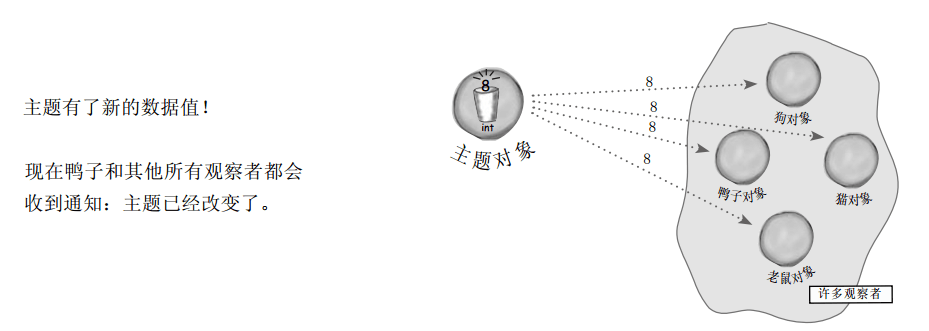

# Java设计模式---观察者模式

Tags： 设计模式

---

##故事概要

###概要

故事要从一个业务需求开始:
> 天气监测站目前可以监测到气温,气压,湿度三种指标,有一个WeatherData类,当前面的三个数据发生变化时,就会调用WeatherData类的setWeatherData()方法,改变天气数据.

现在要求:需要有两个显示装置显示现在的状态和平均状态.当监测的数据有变化时,就更新显示.而且需要提供给第三方的人员可调用这些数据以设置想要的显示装置.如下图:


下面是给出的WeatherData类:
```java
public class WeatherData {

    private float temp;
    private float humidity;
    private float pressure;
    
    public WeatherData(){}
    
    public void setWeatherData(float temp, float humidity, float pressure){
        this.temp = temp;
        this.humidity = humidity;
        this.pressure = pressure;
        dataChanged();
    }
    
    public void dataChanged(){
        //数据发生变化则调用此方法,可在此处填写你的代码
    }
    
    public float getTemp() {
        return temp;
    }
    
    public float getHumidity() {
        return humidity;
    }
    
    public float getPressure() {
        return pressure;
    }
}
```
###提取已知条件

目前已知的条件:
1. WeatherData具有三个getter方法,可获取到温度,气压和湿度三个数值.
2. 当监测到新的数据时就会调用dataChanged()方法.
3. 需要实现两个显示器,一个显示当前状况(CurrentConditionsDisplay),一个显示平均状态(AvgStateDisplay).
4. 系统要能扩展,第三方可以组合实现显示器.

###简单实现
根据以上前提,可以用以下方法实现:
```java
public void dataChanged(){
    //数据发生变化则调用此方法,可在此处填写你的代码
    currentConditionsDisplay.update(temp, humidity, pressure);
    avgStateDisplay.update(temp, humidity, pressure);
}
```
其中,CurrentConditionsDisplay和AvgStateDisplay如下:
```java
//显示当前状态
public class CurrentConditionsDisplay{

    private float temp;
    private float humidity;
    private float pressure;
    
    public void update(float temp, float humidity, float pressure) {
        this.temp = temp;
        this.humidity = humidity;
        this.pressure = pressure;
        display();
    }
    
    public void display(){
        //显示当前状态
        String displayData = "CurrentConditions[temp=" + temp + ", humidity=" + humidity + 
            ", pressure="+ pressure + "]";
        System.out.println(displayData);
    }
}


//显示平均状态
public class AvgStateDisplay {

    public void display() {
        System.out.println(getShowInfo());
    }
    
    private String getShowInfo(){
        StringBuilder displayData = new StringBuilder();
        if (tempList.size() == 0) {
            displayData.append("暂时没有数据...");
            return displayData.toString();
        }
        
        float tempAve = calculatorAve(tempList);
        displayData.append("平均气温:" + tempAve);
        
        float humidityAve = calculatorAve(humidityList);
        displayData.append(",平均湿度:" + humidityAve);
        
        float pressureAve = calculatorAve(pressureList);
        displayData.append(",平均压强:" + pressureAve);
        
        return displayData.toString();
    }
    
    private float calculatorAve(List<Float> dataList){
        float sum = 0F;
        for (Float float1 : dataList) {
            sum = sum + float1;
        }
        float ave = sum/dataList.size();
        return ave;
    }
    
    private List<Float> tempList;
    private float temp;
    private List<Float> humidityList;
    private float humidity;
    private List<Float> pressureList;
    private float pressure;
    
    public void update(float temp, float humidity, float pressure) {
        this.temp = temp;
        this.humidity = humidity;
        this.pressure = pressure;
        if (tempList == null) {
            tempList = new ArrayList<Float>();
        }
        tempList.add(temp);
        
        if (humidityList == null) {
            humidityList = new ArrayList<Float>();
        }
        humidityList.add(humidity);
        
        if (pressureList == null) {
            pressureList = new ArrayList<Float>();
        }
        pressureList.add(pressure);
        display();
    }
}
```
这不就实现了刚才的功能:
1. 能显示当前状态
2. 能显示平均状态
3. 第三方可以通过WeatherData的dataChanged()方法获取数据,自己任意显示.

##有没有问题?

上一篇文章学习了Java设计的原则:

> 封装变化和面向接口编程

上述的实现中:
```java
public void dataChanged(){
    //数据发生变化则调用此方法,可在此处填写你的代码
    currentConditionsDisplay.update(temp, humidity, pressure);
    avgStateDisplay.update(temp, humidity, pressure);
}
```
这个里面的3,4两句是变化的,这部分没有封装.而且应该面向接口编程而不是面向具体的类编程,如果增加第三方的显示器,只能修改此处添加代码

##认识观察者模式

###从订阅报纸开始
报纸的订阅过程一般如下:

- 报社的业务就是出版报纸。
- 向某家报社订阅报纸，只要他们有新报纸出版，就会给你送来。只要你是他们的订户，你就会一直收到新报纸。
- 当你不想再看报纸的时候，取消订阅，他们就不会再送新报纸来。
- 只要报社还在运营，就会一直有人（或单位）向他们订阅报纸或取消订阅报纸。

观察者模式就和上面的订报纸差不多:

> 出版者改称为“主题”（Subject），订阅者改称为“观察者”（Observer）





